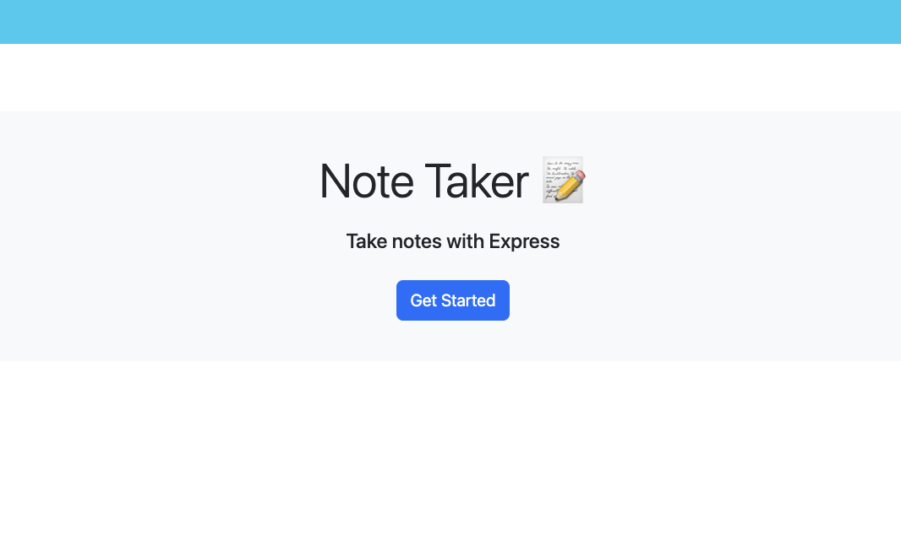

# note-taker

    

## Description
A note-taking app with the ability save and render content onto the page.

## License
This project is licensed under the [MIT](https://opensource.org/licenses/MIT) license.

# Initial setup

1. To begin working with this project, you need to have several essential tools installed on your system. Follow these steps to install the necessary tools:

2. Install Visual Studio Code
-Visual Studio Code (VS Code) is a powerful code editor that provides many features to aid in development.
-Download and install Visual Studio Code from [here](https://code.visualstudio.com/Download).
-Follow the installation instructions for your operating system.

3. Install Git (if on Windows)
-Git is a version control system that helps track changes in your code and collaborate with others.

4. Download and install Git from [here](https://git-scm.com/downloads).
-Follow the installation instructions for your operating system.

5. Install Node.js
-Node.js is a JavaScript runtime that allows you to run JavaScript code outside of a browser.
-Download and install Node.js from [here](https://nodejs.org/en).
-Follow the installation instructions for your operating system.

# Project setup

1. [Clone the project repository](https://docs.github.com/en/repositories/creating-and-managing-repositories/cloning-a-repository)

2. [Install Inquirer](https://www.npmjs.com/package/inquirer/v/8.2.4)

3. Install other dependencies through the `npm i` command.

# Usage
- This note-taker allows you to take notes directly on the website and render it onto the page.

## To use the application:
[Note-taking Application](https://note-taker-xa68.onrender.com)

# Languages
HTML, CSS, JavaScript

# Contribution
Want to improve this project? Great! We encourage contribution to make this project even better. Here are some ways you can contribute:
- Report Bugs: If you find any issues, please report them.
- Suggest feautures: Do you have an idea for a new feature? Share it with us!
- Contribute code: If you have programming skills, feel free to contribute code to the project.
- Provide feedback: Your feedback on the project is valuable. Let us know what you think!

# Work in progress
- Need the trash can icon to remove notes from the applicating

# Future features
- An archive folder
- A trash can to remove unnecessary notes

# Questions
## Contact Me

- GitHub: [uwttn](https://github.com/uwttn)
- LinkedIn: [uwttn](https://www.linkedin.com/in/uwttn)
